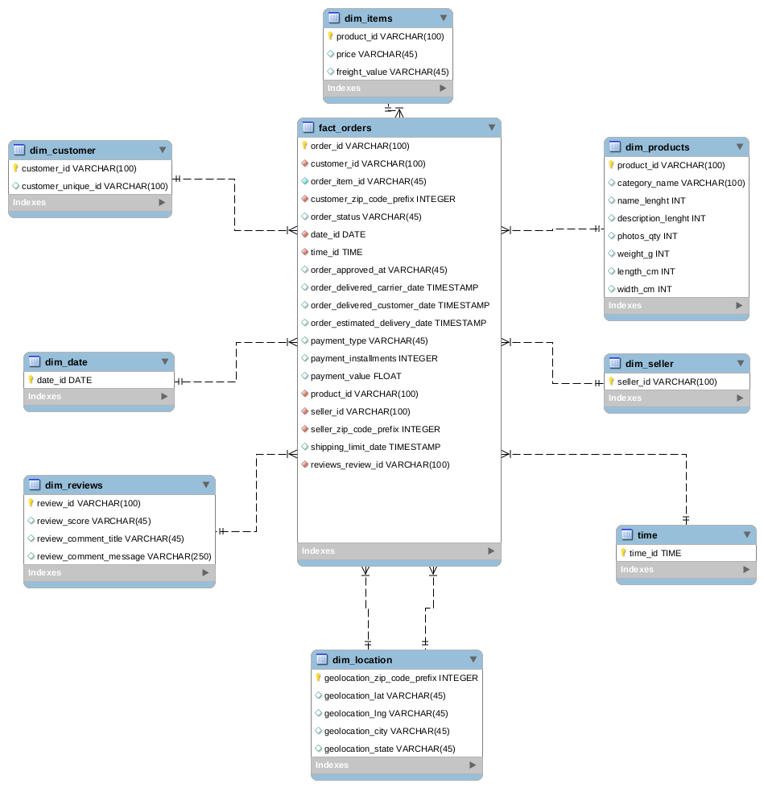
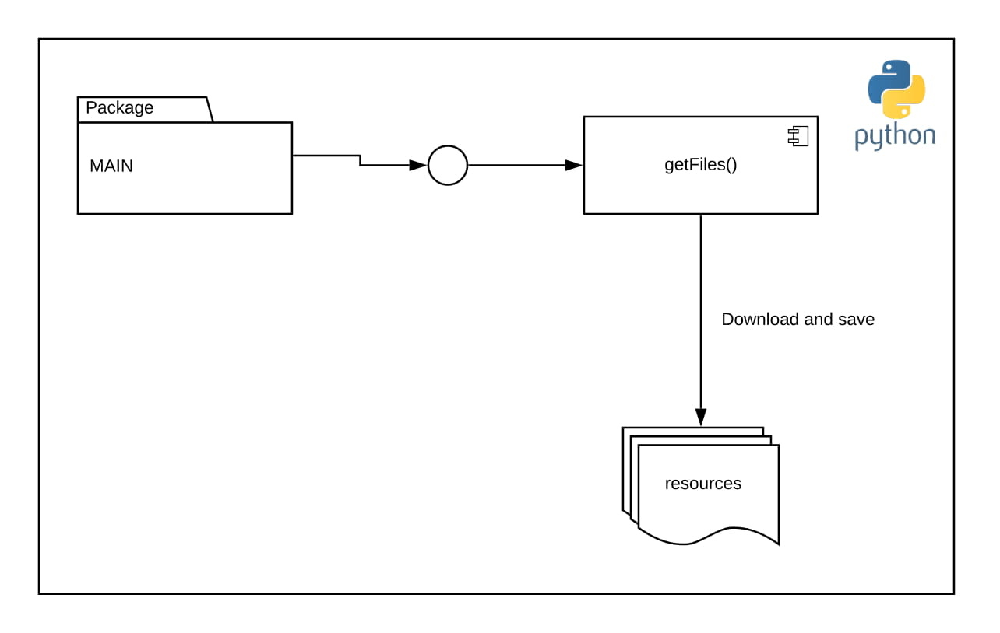
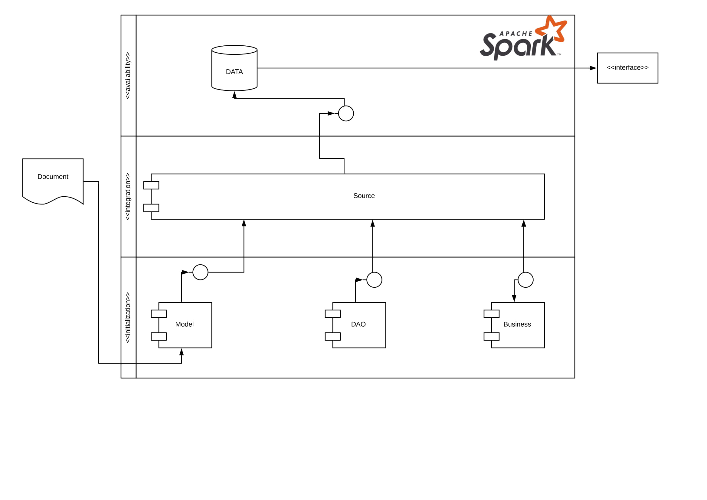
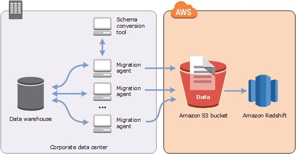

# Modelagem e ingestão de dados

## Table of contents
1. Resumo
2. Solução
    - Proposta de modelo relacional
    - Coleta de dados utilizando Python
    - Normalização de dados utilizando Apache Spark
3. Resultados
4. Proposta de migração para ambiente Cloud AWS. 

* Resumo 

O counteúdo deste repositório tem como objetivo demonstrar um fluxo de dados para realizar a normalização de um banco de 
dados utilizando como base **Apache Spark**. Além disso, o processo gera um relatório consumindo todos os dados coletados e 
salva no diretório base deste repositório.

* Solução

Como destacado anteriormente, o case foi solucionado com base na tecnologia **Spache Spark** e outras tecnologias que 
viabilizaram esta POC:
1. [Apache Spark](https://spark.apache.org/)
2. [Python 3](https://www.python.org/)
3. [Mysql](https://www.mysql.com/)

* Proposta de modelo relacional

O modelo relacional foi implementado sob o banco relacional **MySql Versão 14.14 Distribuição 5.7.30, para Linux** conforme 
o Diagrama de Entidade e Relacionamento abaixo:

Logicamente, o modelo foi segmentado em dois principais componentes para a extração de dimensões 
e fatos da base denormalizada inspirado no modelo **Star Schema (Kimball)**:

1. Tabelas dimensionais:
    - Customer
    - Date
    - Reviews 
    - Location
    - Time
    - Seller
    - Products
    - Items
2. Tabela Fato
    - Orders

### Coleta de dados utilizando Python
A estrutura necessária para a coleta dos dados amostrais foi realizada utlizando o módulo `getfiles()` contidos no pacote `main`.

#### Normalização de dados utilizando **Python / Spark**
A organização do código Pyspark utilizada nesta POC seguiu o padrão semelhante a Arquitetura Orientada a Serviços (SOA) 
evidenciado abaixo. Este padrão contribui para fácil manutenção do código fonte e principalmente para escalabilidade de análises sob o dado coletado.

:pushpin: **Pyspark** foi a linguagem como base para utilização de ferramentas Big Data.

###### Model (Database Access Object)
Este componente tem como principal responsabilidade padronizar por meio de uma interface o acesso a diversos conjuntos 
de dados ( inicialmente csv's e tabelas de bancos de dados relacionais (ex.: Mysql 5.7 utilizado nesta POC)

###### DAO 
Este componente tem como principal responsabilidade manter pequenos trechos de códigos que são comumnente utilizados (ex: SparkContext)).

###### Business
Este componente tem como principal responsabilidade extrair os dados necessários para a execução das implementações dadas via regra de negócio.

###### Source
Este componente tem como principal responsabilidade realizar a junção das regras de negócio e por sua vez prover a visão final do dado.

####Resultados
A POC em destaque transforma o modelo inicial de dados em um modelo Data Warehouse (DW).
O conjunto de tabelas no DW por sua vez, consolida informações coletadas a partir de múltiplos sistemas e também
de inúmeros data sources.
Nesta POC o DW armazena informações sobre as compras feitas por clientes, que estão armazenadas nas tabelas dimensionais e são consolidadas 
na principal dabela do DW, a tabela fato. Esta por sua vez, contém todas as métricas necessárias para análises, como por exemplo, o total de vendas em um mês, os produtos mais vendidos,
os horarios das compras rellizadas por clientes, indormações sobre produtos, datas de entrega e etc..

#####Proposta de migração para ambiente Cloud AWS.
Visão geral da conversão de esquema

A AWS SCT oferece uma interface de usuário baseada em projeto que permite converter automaticamente o esquema do banco 
de dados de origem em um formato que seja compatível com a instância do Amazon RDS de destino. Se o esquema do banco de 
dados de origem não puder ser convertido automaticamente, a AWS SCT fornecerá orientação sobre como criar um esquema equivalente 
no banco de dados Amazon RDS de destino.

***Para realizar a execução em uma instância Ubuntu armanazenada do Google Cloud siga os passos a seguir*** 
 
- No Linux/Ubuntu:

1. Copie a chave de acesso que está no díretório.

     Abra o terminal (CTRL+ALT+t)
    `cp key/keys.pub /home/{seu_uruario}/.ssh`
    - Solicite a inicialização da instância ao [OWNER](https://github.com/eguidos) do projeto.

2. Conecte ao servidor via `ssh peanut@{ip_fornecido}`

3. Acesse o diretório /dotz contido na WorkMachine:
    `cd olist/`
4. Execute o arquivo `run.sh` para instalação das dependências necessárias e a execução do pipeline de ingestão.
    `./run.sh`
    
- Windows via Putty:

O Putty é um software de código livre, que tem como objetivo simular um terminal SSH para o Windows. Através deve é possível manter conexões SSH, Telnet e até tuneis.
1. Abra o PuTTY. Caso não tenha, realize o download acessando o site [Putty](htts://putty.org)

2. À esquerda, na configuração, em Connection->SSH->Auth temos o campo “Private key file for authentication”. Clique em Browse e carregue o arquivo com sua chave privada:

3. - Solicite a inicialização da instância no Google Coud ao [OWNER](https://github.com/eguidos) do projeto.

4. Agora volte no item Session para informar os dados de conexão e salvar a sessão.

5. Em Host Name, preencha com o nome do servidor de acesso `peanut`.

6. Em Port, informe a porta 22 (padrão do SSH).

7. Mantenha SSH, que é o protocolo de comunicação.

8. Em Saved Session (marcado com verde), informe um nome para essa sessão.

9. Clique no botão Sasve para salvar a sessão, assim você não precisará ficar informando o arquivo de chave privada toda vez que for conectar.

10. Selecione a sua sessão salva e clique no botão Open.

11. Repita os pasos 3 e 4 descritos na execução em sistemas `Linux/Ubuntu`
    
O relatório contendo as execuções serão amarzenados no diretório root, conforme mencionado anteriormente.

Para vizualizar os dados inseridos siga os passos abaixo:

- Digite `mysql -u root -p` em seguida `admin` para password;

- Digite os comamndos:
`use olist;`
`select * from dim_customer`
`select * from dim_date`
`select * from dim_items`
`select * from dim_location`
`select * from dim_products`
`select * from dim_reviews`
`select * from dim_seller`
`select * from dim_sellers`
`select * from dim_time`
`select * from fact_orders`      
  